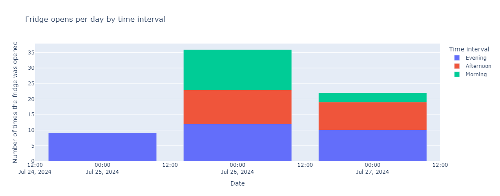

# Fridge-Access-Project

I had an unused Zigbee vibration sensor at home that was not used for any automation. Wanting to put my data skills to use, I decided to use it towards a data gathering project. Therefore, I placed it in the Fridge, as any other person would. I wanted to know, how many times a day, do I open the fridge ❄️, what are the most common hours, and what are the most common days. So far, I have only a few days of data, but will constantly adapt the project with new developments.

I've updated the program so that the analysis is done (manually) in a python script and parsed as .json format. Then, the front-end takes it up via JS and displays it on the link below.

You can check the data here: 

## Analysis

I am analyzing how many times a day the fridge was opened and during what intervals. So far, I am using the following time intervals:

- **07:00-12:00** - Morning
- **12:00-17:00** - Afternoon
- **17:00-23:59** - Evening
- **Else** - Night

## Visualizations

I am using the following libraries for data visualization:
- **matplotlib**: For static plots.
- **Bokeh**: For interactive plots.
- **Plotly**: For interactive plots.

The data from the sensor is processed and visualized to provide insights into the usage patterns of the fridge.

This is the sensor used for the project: 

Example Data Plot: 

---

This project is a work in progress, and I plan to add more features and automate the data collection process in the future.
